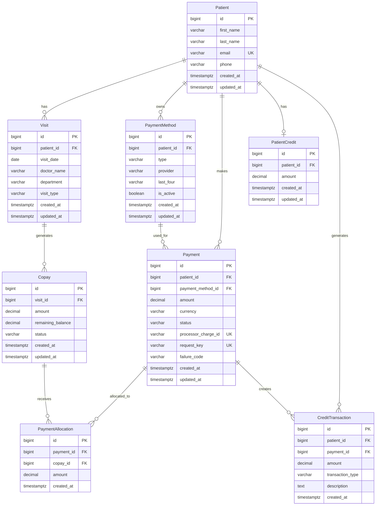
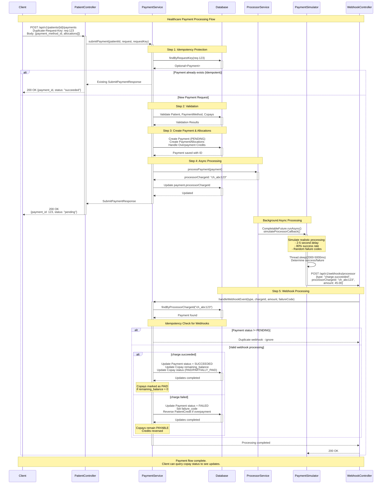

# Design Documentation

This document outlines the architectural decisions, design patterns, and technical choices for the healthcare patient copay management system. The system handles copay tracking, payment processing with external processor integration, and AI-powered financial insights while maintaining data consistency and resilience.

## Design Assumptions

### Project Scope and Limitations
- **Interview Context**: This is a demonstration project built within time constraints, not a production-ready system
- **Currency Support**: System only handles USD payments - multi-currency support is out of scope
- **Security**: APIs served over HTTP for development - production deployment would require HTTPS/TLS
- **Authentication/Authorization**: No user authentication implemented - production would need role-based access control
- **Payment Processor**: Uses simulated processor - production would integrate with real providers (Stripe, Square, etc.)

### Healthcare Business Context
- **Copay Types**: Handles standard medical copays only - deductibles, coinsurance, and complex billing scenarios out of scope

### Financial Processing Constraints
- **Payment Methods**: Supports credit cards, bank accounts, and digital wallets via payment method table - specific processor integration details simplified
- **Compliance**: Basic audit trails implemented - full PCI DSS, HIPAA compliance would require additional security measures

### Technical Simplifications
- **Database**: Single PostgreSQL instance - production would need read replicas, backup strategies, and disaster recovery
- **Monitoring**: Basic logging implemented - production requires comprehensive monitoring, alerting, and observability
- **Rate Limiting**: No API rate limiting implemented - production would need throttling and DDoS protection

### Data Model Design Decisions
- **Currency Support**: Current implementation assumes USD payments only, but database schema includes `currency` field (VARCHAR(3)) to support future multi-currency expansion using ISO currency codes
- **Decimal Precision**: Business requirement specifies whole dollar copay amounts, but database uses `DECIMAL(10,2)` to support cents-level precision for future flexibility and accurate financial calculations
- **Extensibility**: Schema designed to accommodate future enhancements without requiring major migrations

### Payment Credit System
- **Patient Credit Storage**: Database includes `patient_credit` and `credit_transaction` tables to track overpayment credits, but current payment service does not support using stored credits as payment method
- **Future Enhancement**: Schema designed to enable credit-based payments in future development - would require additional validation logic and credit deduction workflows
- **Credit Lifecycle**: Currently credits are only created (from overpayments) and reversed (from failed payments), but infrastructure exists for credit utilization features

### AI Integration Assumptions
- **Modern Healthcare Technology**: AI-powered financial insights represent current healthcare industry trends toward intelligent patient engagement and operational efficiency
- **OpenAI Dependency**: Relies on external OpenAI API availability - production would need SLA agreements and failover strategies
- **Data Privacy**: AI processing assumes consent for copay data analysis - production requires explicit patient consent mechanisms
- **Model Selection**: Uses GPT-3.5-turbo for cost efficiency - production might use more advanced models based on business requirements

### Development and Testing Constraints
- **Test Coverage**: Basic validation tests implemented - comprehensive test suite would include integration, performance, and security testing
- **Error Scenarios**: Covers common error cases - production would need extensive edge case handling
- **Data Migration**: Uses Flyway for schema - production data migration strategies not addressed
- **Configuration Management**: Basic application.properties setup - production needs environment-specific configuration management

## Entity Relationship Diagram (ERD)



## System Architecture

### High-Level System Architecture

```mermaid
flowchart TB
    subgraph "Client Applications"
        CLIENT[Client Applications]
        POSTMAN[API Testing Tools]
    end
    
    subgraph "Spring Boot Application"
        subgraph "Controllers"
            PATIENT_CTRL[PatientController<br/>patients API]
            WEBHOOK_CTRL[WebhookController<br/>webhooks API]
        end
        
        subgraph "Services"
            COPAY_SVC[CopayService]
            PAYMENT_SVC[PaymentService]
            AI_SVC[SimpleAiService]
            PROCESSOR_SVC[ProcessorService]
        end
        
        subgraph "Repositories"
            PATIENT_REPO[PatientRepository]
            COPAY_REPO[CopayRepository]
            PAYMENT_REPO[PaymentRepository]
            ALLOCATION_REPO[AllocationRepository]
            CREDIT_REPO[CreditRepository]
        end
        
        subgraph "Exception Handling"
            GLOBAL_HANDLER[GlobalExceptionHandler]
        end
    end
    
    subgraph "External Services"
        OPENAI[OpenAI API<br/>gpt-3.5-turbo]
        SIMULATOR[Payment Processor<br/>Simulator]
    end
    
    subgraph "Database"
        POSTGRES[(PostgreSQL<br/>Flyway Migrations)]
    end
    
    %% API Flow 1: List Copays
    CLIENT -->|GET copays| PATIENT_CTRL
    PATIENT_CTRL --> COPAY_SVC
    COPAY_SVC --> COPAY_REPO
    COPAY_REPO --> POSTGRES
    POSTGRES --> COPAY_REPO
    COPAY_REPO --> COPAY_SVC
    COPAY_SVC --> PATIENT_CTRL
    PATIENT_CTRL -->|CopayDTO List| CLIENT
    
    %% API Flow 2: AI Summary
    CLIENT -->|GET AI summary| PATIENT_CTRL
    PATIENT_CTRL --> AI_SVC
    AI_SVC --> COPAY_SVC
    COPAY_SVC --> COPAY_REPO
    COPAY_REPO --> POSTGRES
    AI_SVC -->|Copay Analysis| OPENAI
    OPENAI -->|AI Insights| AI_SVC
    AI_SVC --> PATIENT_CTRL
    PATIENT_CTRL -->|AI Summary Response| CLIENT
    
    %% API Flow 3: Payment Processing
    CLIENT -->|POST payment| PATIENT_CTRL
    PATIENT_CTRL --> PAYMENT_SVC
    PAYMENT_SVC -->|Idempotency Check| PAYMENT_REPO
    PAYMENT_REPO --> POSTGRES
    PAYMENT_SVC -->|Create Payment| PAYMENT_REPO
    PAYMENT_SVC -->|Handle Credits| CREDIT_REPO
    PAYMENT_REPO --> POSTGRES
    CREDIT_REPO --> POSTGRES
    PAYMENT_SVC --> PROCESSOR_SVC
    PROCESSOR_SVC -->|Async Processing| SIMULATOR
    PAYMENT_SVC -->|Payment Response| PATIENT_CTRL
    PATIENT_CTRL --> CLIENT
    
    %% Async Webhook Flow
    SIMULATOR -->|Process Payment| SIMULATOR
    SIMULATOR -->|Webhook Callback| WEBHOOK_CTRL
    WEBHOOK_CTRL --> PAYMENT_SVC
    PAYMENT_SVC -->|Find Payment| PAYMENT_REPO
    PAYMENT_REPO --> POSTGRES
    PAYMENT_SVC -->|Update Status| PAYMENT_REPO
    PAYMENT_SVC --> COPAY_REPO
    PAYMENT_SVC --> CREDIT_REPO
    PAYMENT_REPO --> POSTGRES
    COPAY_REPO --> POSTGRES
    CREDIT_REPO --> POSTGRES
    WEBHOOK_CTRL -->|200 OK| SIMULATOR
    
    %% Error Handling
    PATIENT_CTRL -.->|Exceptions| GLOBAL_HANDLER
    WEBHOOK_CTRL -.->|Exceptions| GLOBAL_HANDLER
    PAYMENT_SVC -.->|Validation Errors| GLOBAL_HANDLER
    AI_SVC -.->|Fallback to System| AI_SVC
```


### Payment Processing Flow



## Resilience Design Choices

### 1. Idempotency Protection

Duplicate-Request-Key header with database lookup using `request_key` field

### 2. Asynchronous Payment Processing

Uses CompletableFuture.runAsync() for non-blocking payment processor calls. Real payment processors (Stripe, Square) operate asynchronously, so the API returns immediately with "pending" status while processing completes in background via webhook callbacks. This prevents user interface blocking and timeout issues.

### 3. AI Service Fallback Strategy

Uses try-catch block around OpenAI API calls with system-generated fallback when AI service fails, times out, or is rate-limited. The fallback creates structured copay summaries using business rules and financial calculations, ensuring the copay summary feature always works even when AI enhancement is unavailable. This maintains consistent user experience regardless of external service availability.

### 4. Webhook Duplicate Handling

Validates payment status before processing webhooks to prevent duplicate processing. Payment processors often send duplicate webhooks due to network retries or internal failover mechanisms. The system checks if payment status is still PENDING before applying updates, ignoring subsequent webhooks for the same charge. This prevents erroneous status updates that could mark failed payments as successful.

### 5. Payment Processor Simulation
Simulates realistic payment processor behavior with 2-5 second delays and 80% success rate. Includes random failure codes (card_declined, insufficient_funds, etc.) to test error handling scenarios. This allows comprehensive testing of both success and failure workflows without requiring actual payment processor integration during development.

### 6. Error Handling and Validation

Uses GlobalExceptionHandler with structured error responses that include error codes, messages, and retryable flags. Validates input at multiple layers (controller annotations, service business rules) to catch errors early. Provides consistent JSON error format across all endpoints without exposing internal system details, helping clients determine appropriate retry strategies.

### 7. Database Transaction Management

Applies @Transactional annotations to ensure atomic operations across related database changes. Payment processing involves multiple updates (payment, allocations, copay balances, credits) that must succeed or fail together. Transaction rollback prevents partial updates that could leave financial data in inconsistent states, maintaining data integrity for audit and compliance requirements.

### 8. Overpayment and Credit Management

Automatically handles overpayment scenarios by creating patient credits for amounts exceeding copay balances. Rather than rejecting overpayments, the system accepts them and stores excess amounts as credits for future use. If payments ultimately fail, credits are automatically reversed to maintain accurate patient account balances. This improves patient experience while maintaining financial accuracy.

## API Design Patterns

### RESTful Endpoint Structure

Follows standard REST conventions with resource-based URLs and appropriate HTTP methods:

- **Resource Hierarchy**: `/api/v1/patients/{id}/copays` - copays are sub-resources of patients
- **HTTP Methods**: GET for retrieval, POST for creation, following semantic meaning
- **Path Parameters**: Patient ID in URL path for resource scoping and security
- **Query Parameters**: Optional filtering with `?status=payable` for copay endpoint
- **Versioning**: API versioned at `/api/v1/` level to support future changes
- **Consistent Naming**: Kebab-case for URLs, camelCase for JSON fields
- **Webhook Convention**: Separate `/webhooks/` namespace for processor callbacks

**Examples**:
- `GET  /api/v1/patients/123/copays?status=payable`
- `POST /api/v1/patients/123/payments`
- `POST /api/v1/webhooks/processor`

### Request/Response Standards

Maintains consistent data formats and conventions across all endpoints:

- **Content Type**: All requests and responses use `application/json`
- **HTTP Status Codes**: Standard codes (200, 201, 400, 404, 409, 500) with semantic meaning
- **Request Headers**: `Duplicate-Request-Key` for idempotency, `Content-Type` required for POST
- **Response Structure**: Consistent wrapper objects (ListCopaysResponse, SubmitPaymentResponse, CopayAISummaryResponse)
- **Field Naming**: camelCase for JSON fields, snake_case for database columns
- **Date Format**: ISO 8601 timestamps (LocalDateTime serialized as ISO strings)
- **Decimal Handling**: Financial amounts as decimal strings to prevent floating-point precision issues
- **Null Handling**: Optional fields explicitly marked, required fields validated

**Request Example**:
```json
{
  "paymentMethodId": 1,
  "currency": "USD",
  "allocations": [
    {"copayId": 101, "amount": 25.00},
    {"copayId": 102, "amount": 50.00}
  ]
}
```
**Response Example**:
```json
{
  "paymentId": 123,
  "status": "pending"
}
```

### Error Response Format

Standardized error structure using GlobalExceptionHandler for consistent client experience:

**Standard Error Response**:
```json
{
  "timestamp": "2024-01-15T10:30:00Z",
  "path": "/api/v1/patients/123/payments",
  "errorCode": "RESOURCE_NOT_FOUND",
  "message": "Patient with ID 123 not found",
  "retryable": false
}
```
**Error Categories**:
- **400 Bad Request**: Invalid input format, validation failures, malformed JSON, unsupported parameters
- **404 Not Found**: Patient, copay, or payment method not found
- **409 Conflict**: Duplicate request detected (idempotency protection)
- **422 Unprocessable Entity**: Business rule violations (excessive allocation amounts, etc.)
- **500 Internal Server Error**: Unexpected system errors

**Key Features**:
- **Error Codes**: Machine-readable codes for client error handling logic
- **Retryable Flag**: Indicates whether clients should retry the request
- **Structured Messages**: Human-readable descriptions without exposing internal details
- **Request Context**: Path and timestamp for debugging and logging correlation
- **Security**: No stack traces or sensitive system information exposed

## Technology Stack

### Core Framework
- **Spring Boot 3.x**: Main application framework with auto-configuration and embedded Tomcat
- **Spring Web MVC**: RESTful API development with @RestController and request mapping
- **Spring Data JPA**: Repository pattern implementation with automatic query generation
- **Spring Validation**: Bean validation using Jakarta validation annotations (@Valid, @NotNull)
- **Spring Transaction Management**: @Transactional for database consistency
- **Java 17+**: Modern Java features and language improvements

### Database and Migrations
- **PostgreSQL**: Primary relational database for ACID compliance and complex queries
- **Flyway**: Database migration management with versioned SQL scripts
- **HikariCP**: High-performance JDBC connection pooling (Spring Boot default)
- **JPA/Hibernate**: Object-relational mapping with entity management

### External Integrations
- **OpenAI API**: GPT-3.5-turbo integration for AI-powered copay summaries via WebClient
- **Spring WebClient**: Reactive HTTP client for external API calls with timeout handling
- **RestTemplate**: HTTP client for internal webhook simulation calls
- **CompletableFuture**: Asynchronous processing for payment processor simulation

### Testing and Validation
- **JUnit 5**: Unit testing framework for service layer logic
- **Spring Boot Test**: Integration testing with @SpringBootTest
- **Bean Validation**: Input validation with Jakarta validation annotations
- **Lombok**: Code generation for boilerplate reduction (@RequiredArgsConstructor, @Slf4j)
- **SLF4J + Logback**: Structured logging with different log levels

